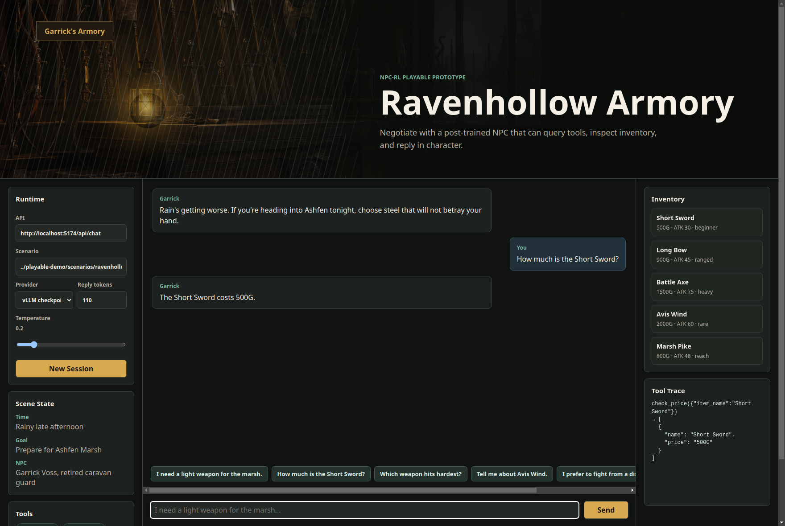

# Playable NPC Demo

A static browser demo for the FastAPI service in `../NPC-agent/service/api.py`.
All demo-specific scenario content lives here:



- `scenarios/ravenhollow_armory.yaml` - NPC persona, game state, tool list, and item knowledge.
- `index.html` / `styles.css` / `app.js` - browser UI, suggested prompts, tool trace panel, and runtime controls.

## Run

Start the service:

```bash
NPC_PROVIDER=scripted \
python3 -m uvicorn --app-dir NPC-agent service.api:app --host 0.0.0.0 --port 8120
```

Or use the trained model through vLLM:

```bash
OPENAI_BASE_URL=http://localhost:8112/v1 \
OPENAI_MODEL=/path/to/merged/checkpoint \
python3 -m uvicorn --app-dir NPC-agent service.api:app --host 0.0.0.0 --port 8120
```

Serve the static UI:

```bash
python3 -m http.server 5173 -d playable-demo
```

Then open `http://localhost:5173`. The page sends requests to `http://localhost:8120/api/chat` by default and passes `playable-demo/scenarios/ravenhollow_armory.yaml` as the active scenario.
